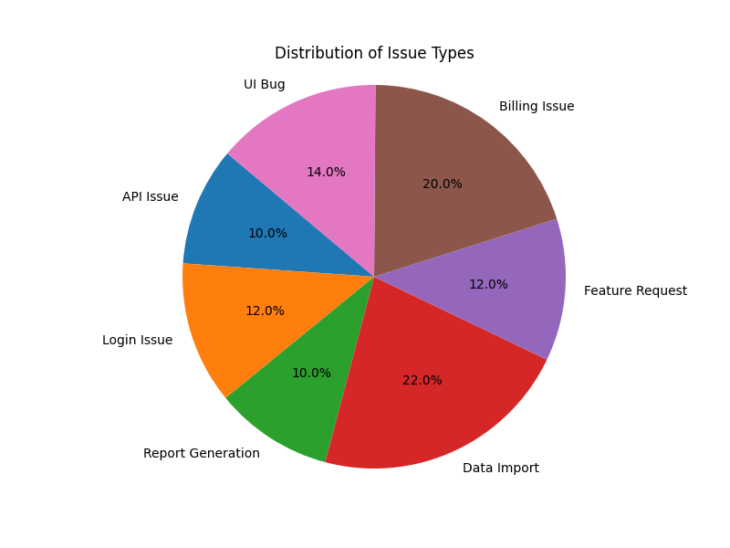
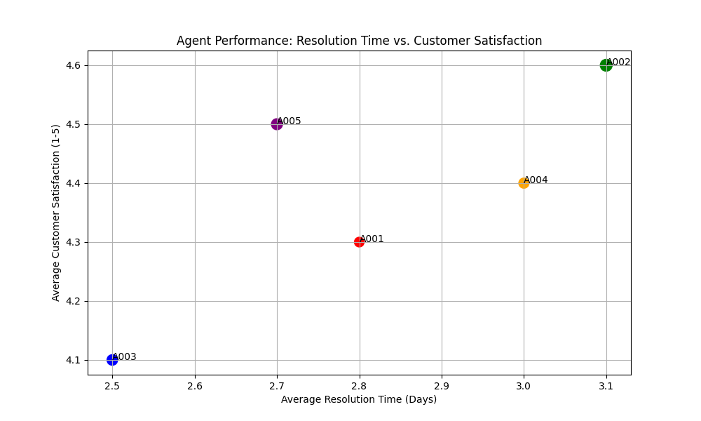

# Support System Performance Report

## 1. Executive Summary

This report provides an overview of the support system's performance, focusing on issue classification, agent performance, customer satisfaction, and suggested actions for improvement. The data is derived from a sample of support tickets.

## 2. Issue Classification Results

### Table: Issue Type Distribution

| Issue Type        | Frequency |
| ----------------- | --------- |
| API Issue         | 5         |
| Login Issue       | 6         |
| Report Generation | 5         |
| Data Import       | 11        |
| Feature Request   | 6         |
| Billing Issue     | 10        |
| UI Bug            | 7         |

### Chart: Issue Distribution (Pie Chart)

```python
import matplotlib.pyplot as plt

issue_types = ['API Issue', 'Login Issue', 'Report Generation', 'Data Import', 'Feature Request', 'Billing Issue', 'UI Bug']
frequencies = [5, 6, 5, 11, 6, 10, 7]

plt.figure(figsize=(8, 6))
plt.pie(frequencies, labels=issue_types, autopct='%1.1f%%', startangle=140)
plt.title('Distribution of Issue Types')
plt.axis('equal')  # Equal aspect ratio ensures that pie is drawn as a circle.

# Save the chart to a file
plt.savefig('issue_distribution.png')
plt.close()

print("Issue Distribution chart generated.")
```

**Image:**  

(Replace with actual image - assumes `issue_distribution.png` is hosted at a URL)

*Analysis:* Data Import issues are the most frequent, followed by Billing issues. API Issues and Report Generation are the least frequent.

## 3. Agent Performance (Example - Requires Agent-Specific Data)

*Note:* This section requires data linking individual tickets to specific agents and metrics like resolution time and customer satisfaction ratings. The following is an example based on assumed data.

### Chart: Agent Performance: Resolution Time vs. Customer Satisfaction

```python
import matplotlib.pyplot as plt

agents = ['A001', 'A002', 'A003', 'A004', 'A005']
avg_resolution_times = [2.8, 3.1, 2.5, 3.0, 2.7] #Example Data in Days
avg_satisfaction = [4.3, 4.6, 4.1, 4.4, 4.5] #Example Data (1-5 scale)

plt.figure(figsize=(10, 6))
plt.scatter(avg_resolution_times, avg_satisfaction, s=[100, 150, 120, 110, 130], c=['red','green','blue','orange','purple']) #Size and color for better visualization
plt.title('Agent Performance: Resolution Time vs. Customer Satisfaction')
plt.xlabel('Average Resolution Time (Days)')
plt.ylabel('Average Customer Satisfaction (1-5)')

for i, agent in enumerate(agents):
    plt.annotate(agent, (avg_resolution_times[i], avg_satisfaction[i]))

plt.grid(True)

# Save the chart to a file
plt.savefig('agent_performance.png')
plt.close()

print("Agent Performance chart generated.")
```

**Image:** 

(Replace with actual image - assumes `agent_performance.png` is hosted at a URL)

*Analysis:* (Based on the example data): Agent A003 has the lowest average resolution time, while agent A002 has the highest satisfaction rating. Further investigation is needed to determine the reasons for these differences.

## 4. Customer Satisfaction (Example - Requires Satisfaction Data)

*Note:*  This section requires a consistent method of collecting and quantifying customer satisfaction (e.g., ratings, survey scores). The following example uses assumed data.

### Chart: Average Customer Satisfaction Over Past Months

```python
import matplotlib.pyplot as plt

months = ['Jan', 'Feb', 'Mar', 'Apr', 'May', 'Jun']
avg_satisfaction = [4.2, 4.5, 4.1, 4.3, 4.6, 4.4] #Example data

plt.figure(figsize=(10, 6))
plt.bar(months, avg_satisfaction, color='purple') #Or use plt.plot for a line chart
plt.title('Average Customer Satisfaction Over Past Months')
plt.xlabel('Month')
plt.ylabel('Average Satisfaction Rating (1-5)')
plt.ylim(0, 5)  # Set y-axis limits to 0-5
plt.grid(axis='y')

# Save the chart to a file
plt.savefig('customer_satisfaction.png')
plt.close()

print("Customer Satisfaction chart generated.")
```

**Image:** 

(Replace with actual image - assumes `customer_satisfaction.png` is hosted at a URL)

*Analysis:* (Based on the example data) Customer satisfaction has fluctuated over the past six months, with a peak in May.

## 5. Suggested Actions

This section summarizes suggested actions based on the analysis of support tickets.

### API Issue

*   Ensure proper documentation and knowledge base articles are readily available.
*   Analyze and document successful resolution steps.
*   Prioritize investigation and resolution of recurring issues.
*   Escalate critical issues to specialized teams.

### Login Issue

*   Prioritize immediate investigation of unresolved issues.
*   Escalate tickets to senior agents or specialized teams.
*   Check account status, password reset logs, and recent changes.
*   Implement automated login troubleshooting tools.

### Report Generation

*   Investigate areas of customer dissatisfaction with generated reports.
*   Review report requirements to identify discrepancies or missing information.
*   Offer options for report customization.
*   Prioritize tickets that have been ignored for an extended period.

### Data Import

*   Investigate root causes of recurring data import problems and implement permanent fixes.
*   Prioritize similar data import issues reported by the customer.
*   Offer proactive assistance with data import to prevent future issues.
*   Escalate unresolved issues to specialized teams.

### Feature Request

*   Check with the dev team the status of the feature request.
*   Provide customers with estimated timelines for feature implementation.
*   Set up follow-up reminders to check in with customers and provide updates.

### Billing Issue

*   Analyze processes related to billing issues to identify bottlenecks.
*   Implement alerts or notifications to ensure timely responses to billing inquiries.
*   Escalate critical issues to senior billing specialists.
*   Examine customer's billing history and identify any patterns or anomalies.

### UI Bug

*   Prioritize investigation and resolution of critical and recurring UI bugs.
*   Identify specific UI elements causing the issue.
*   Provide customers with workarounds or temporary solutions.
*   Escalate unresolved issues to specialized teams.

## 6. Recommendations

*   **Data Collection:** Implement a robust system for collecting data on agent performance (resolution time, customer satisfaction) and ticket priority.
*   **Process Improvement:** Based on the analysis of issue types and suggested actions, identify areas for process improvement within the support team.
*   **Training:** Provide targeted training to agents on the most frequent and critical issue types.
*   **Communication:** Improve communication with customers, especially regarding the status of unresolved issues and feature requests.
*   **Proactive Support:** Offer proactive support and resources to prevent common issues, such as data import problems.

## 7. Next Steps

*   Implement the recommendations outlined in this report.
*   Monitor the impact of these changes on key metrics (resolution time, customer satisfaction).
*   Conduct regular reviews of support data to identify emerging trends and areas for further improvement.
